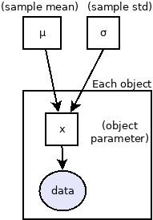

PosteriorStacker
==================

Combines Bayesian analyses from many datasets.

* `Introduction <#introduction>`_
* `Method <#method>`_
* `Tutorial <#tutorial>`_
* `Output plot <#visualising-the-results>`_ and files

Introduction
-------------------

Fitting a model to a data set gives 
posterior probability distributions for a parameter of 
interest. But how do you combine such probability
distributions if you have many datasets?

This question arises frequently in astronomy when
analysing samples, and trying to infer sample
distributions of some quantity.

PosteriorStacker allows deriving sample
distributions from posterior distributions from a number of objects.

Method
-------------------

The method is described in Appendix A of
`Baronchelli, Nandra & Buchner (2020) <https://ui.adsabs.harvard.edu/abs/2020MNRAS.498.5284B/abstract>`_.

The inputs are posterior samples of a single parameter,
for a number of objects. These need to come from pre-existing analyses,
under a flat parameter prior.

The hierarchical Bayesian model (illustrated above) models the sample distribution
as a Gaussian with unknown mean and standard deviation. The per-object
parameters are also unknown, but integrated out numerically using
the posterior samples.

Additional to the Gaussian model (as in the paper), 
a histogram model (using a flat Dirichlet prior distribution) is computed,
which is non-parametric and more flexible.
Both models are inferred using `UltraNest <https://johannesbuchner.github.io/UltraNest/>`_.

The output is visualised in a publication-ready plot.

Synopsis of the program::

	$ python3 posteriorstacker.py --help
	usage: posteriorstacker.py [-h] [--verbose VERBOSE] [--name NAME]
	                           filename low high nbins
	
	Posterior stacking tool.
	
	Johannes Buchner (C) 2020-2021
	
	Given posterior distributions of some parameter from many objects,
	computes the sample distribution, using a simple hierarchical model.
	
	The method is described in Baronchelli, Nandra & Buchner (2020)
	https://ui.adsabs.harvard.edu/abs/2020MNRAS.498.5284B/abstract
	Two computations are performed with this tool:
	
	- Gaussian model (as in the paper)
	- Histogram model (using a Dirichlet prior distribution)
	
	The histogram model is non-parametric and more flexible.
	Both models are computed using UltraNest.
	The output is plotted.
	
	positional arguments:
	  filename           Filename containing posterior samples, one object per line
	  low                Lower end of the distribution
	  high               Upper end of the distribution
	  nbins              Number of histogram bins
	
	optional arguments:
	  -h, --help         show this help message and exit
	  --verbose VERBOSE  Show progress
	  --name NAME        Parameter name (for plot)
	
	Johannes Buchner (C) 2020-2021 <johannes.buchner.acad@gmx.com>

Licence
--------
AGPLv3 (see COPYING file). Contact me if you need a different licence.

Install
--------

Clone or download this repository. You need to install the 
`ultranest <https://johannesbuchner.github.io/UltraNest/>`_
python package (e.g., with pip).

Tutorial
=================================

In this tutorial you will learn:

* How to find a intrinsic distribution from data with asymmetric error bars and upper limits
* How to use PosteriorStacker

Lets say we want to find the intrinsic velocity dispersion given some noisy data points.

Our data are velocity measurements of a few globular cluster velocities in a dwarf galaxy,
fitted with some model.

Preparing the inputs
---------------------

For generating the demo input files and plots, run::

	$ python3 tutorial/gendata.py

Visualise the data
----------------------

Lets plot the data first to see what is going on:

**Caveat on language**: These are not actually "the data" (which are counts on a CCD).
Instead, this is a intermediate representation of a posterior/likelihood,
assuming flat priors on velocity.

Data properties
-----------------

This scatter plot shows:

* large, sometimes asymmetric error bars
* intrinsic scatter

Resampling the data
--------------------

We could also represent each data point by a cloud of samples. Each point represents a possible true solution of that galaxy.

Running PosteriorStacker
=========================

We run the script with a range limit of +-100 km/s::

	$ python3 posteriorstacker.py posteriorsamples.txt -80 +80 11 --name="Velocity [km/s]"
	fitting histogram model...
	[ultranest] Resuming from 2333 stored points
	[ultranest] Explored until L=-1e+01  
	[ultranest] Likelihood function evaluations: 114176
	[ultranest] Writing samples and results to disk ...
	[ultranest] Writing samples and results to disk ... done
	[ultranest]   logZ = -20.66 +- 0.07543
	[ultranest] Effective samples strategy satisfied (ESS = 684.4, need >400)
	[ultranest] Posterior uncertainty strategy is satisfied (KL: 0.46+-0.09 nat, need <0.50 nat)
	[ultranest] Evidency uncertainty strategy is satisfied (dlogz=0.21, need <0.5)
	[ultranest]   logZ error budget: single: 0.07 bs:0.08 tail:0.41 total:0.41 required:<0.50
	[ultranest] done iterating.
	
	logZ = -20.677 +- 0.457
	  single instance: logZ = -20.677 +- 0.074
	  bootstrapped   : logZ = -20.662 +- 0.211
	  tail           : logZ = +- 0.405
	insert order U test : converged: False correlation: 377.0 iterations
	
	    bin1                0.052 +- 0.046
	    bin2                0.053 +- 0.053
	    bin3                0.065 +- 0.060
	    bin4                0.063 +- 0.057
	    bin5                0.109 +- 0.085
	    bin6                0.31 +- 0.14
	    bin7                0.16 +- 0.10
	    bin8                0.051 +- 0.051
	    bin9                0.047 +- 0.043
	    bin10               0.047 +- 0.046
	    bin11               0.046 +- 0.045
	fitting gaussian model...
	[ultranest] Resuming from 3579 stored points
	[ultranest] Explored until L=-4e+01  
	[ultranest] Likelihood function evaluations: 4544
	[ultranest] Writing samples and results to disk ...
	[ultranest] Writing samples and results to disk ... done
	[ultranest]   logZ = -47.33 +- 0.0901
	[ultranest] Effective samples strategy satisfied (ESS = 1011.4, need >400)
	[ultranest] Posterior uncertainty strategy is satisfied (KL: 0.46+-0.06 nat, need <0.50 nat)
	[ultranest] Evidency uncertainty strategy is satisfied (dlogz=0.20, need <0.5)
	[ultranest]   logZ error budget: single: 0.13 bs:0.09 tail:0.41 total:0.42 required:<0.50
	[ultranest] done iterating.
	
	logZ = -47.341 +- 0.453
	  single instance: logZ = -47.341 +- 0.126
	  bootstrapped   : logZ = -47.332 +- 0.203
	  tail           : logZ = +- 0.405
	insert order U test : converged: False correlation: 13.0 iterations
	
	    mean                -0.2 +- 4.6
	    std                 11.6 +- 5.2
	
	Vary the number of samples to check numerical stability!
	plotting results ...

Notice the parameters of the fitted gaussian distribution above.
The standard deviation is quite small (which was the point of the original paper).
A corner plot is at posteriorsamples.txt_out_gauss/plots/corner.pdf

Visualising the results
-----------------------

Here is the output plot, converted to png for this tutorial with::

	$ convert -density 100 posteriorsamples.txt_out.pdf out.png

.. image:: out.png

In black, we see the non-parametric fit.
The red curve shows the gaussian model.

The histogram model indicates that a more heavy-tailed distribution
may be better.

The error bars in gray is the result of naively averaging the posteriors.
This is not a statistically meaningful procedure,
but it can give you ideas what models 
you may want to try for the sample distribution.

Output files
------------

* posteriorsamples.txt_out.pdf contains a plot, 
* posteriorsamples.txt_out_gauss contain the ultranest analyses output assuming a Gaussian distribution.
* posteriorsamples.txt_out_flexN contain the ultranest analyses output assuming a histogram model.
* The directories include diagnostic plots, corner plots and posterior samples of the distribution parameters.

With these output files, you can:

* plot the sample parameter distribution
* report the mean and spread, and their uncertainties
* split the sample by some parameter, and plot the sample mean as a function of that parameter.

If you want to adjust the plot, just edit the script.

If you want to try a different distribution, adapt the script.
It uses `UltraNest <https://johannesbuchner.github.io/UltraNest/>`_
for the inference.

Take-aways
-----------

* PosteriorStacker computed a intrinsic distribution from a set of uncertain measurements
* This tool can combine arbitrarily pre-existing analyses.
* No assumptions about the posterior shapes were necessary -- multi-modal and asymmetric works fine.
